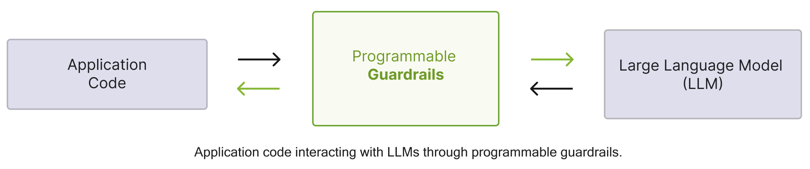
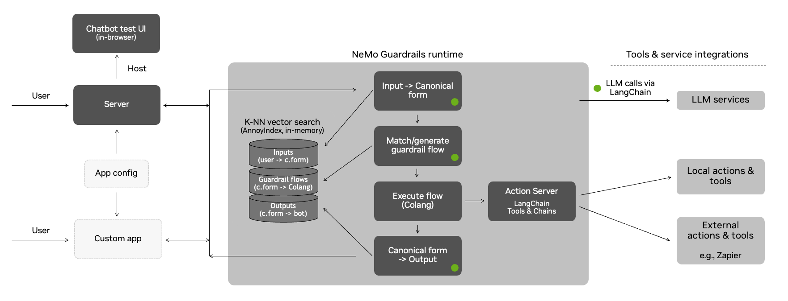

# RAG 安全防护策略调研报告

## 1. 摘要
本报告针对检索增强生成（RAG）技术的潜在安全风险展开分析，结合相关论文和开源项目，
提出多层次的安全防护策略，涵盖数据安全、模型安全、系统安全及合规性要求，旨在为 RAG 系统的安全部署提供参考。
**注：本文不过多介绍 RAG 技术本身和其他底层安全问题（例如网络安全/数据安全...），仅对 RAG 技术本身的安全风险进行分析。**

## 2. RAG 技术概述&&应用场景
### 2.1 技术概述
一个简单的 RAG 系统的使用流程是：用户输入问题 -> 知识库检索 -> 生成答案 -> 返回给用户。

目前东吴证券内部的 RAG 知识库系统包含以下一些模块：
- 知识库存储系统（Minio/Elasticsearch/Postgres...）
- 文件解析器（pdf/docx/excel/markdown loaders...）
- 分块器（TextSplitter...）
- 检索器（Elasticsearch...）
- 向量化模型（bge-embeddings...）
- Reranker 模型（bge-reranker...）
- 生成器（LLMs+Prompt(gpts、qwen、deepseek...)）

### 2.2 应用场景
- 智能问答（AIChat）
- 知识库系统
- 文章摘要
- 智能改写
- 企业数据分析等等

## 3. RAG 安全风险分析
...
### 3.1 数据安全
#### 3.1.1 检索数据污染
在构建数据源初期时，应针对不同的数据制定不同的安全准确入准则，并明确数据安全防护梯度，实现对数据的多层防护，保证数据源的可信。

#### 3.1.2 无数据访问权限控制
在设计初期，RAG 数据治理需要考虑安全问题，对于有数据风险的数据，需要考虑安全策略防护。例如对于用户个人上传的私人数据集仅允许个人访问。
对于企业内部知识库系统，应设计权限管理机制，确保只有授权用户才能访问知识库。

### 3.2 提示注入攻击
1. 提示注入攻击用户通过提供恶意数据、提示注入等方法，使得 RAG 系统生成的答案包含恶意代码或恶意指令，产生不友好的问答
2. 通过引导大模型挖掘隐私数据，产生数据泄漏风险。

### 3.3 模型层
#### 3.3.1 API 滥用
- 对于用户在使用大模型进行问答过程中，应控制调用者的使用频率

## 4. RAG 安全防护策略
### 4.1 输入内容审查机制
- 准入控制：对知识源进行严格控制（可信来源白名单、内容审核、内容过滤）
- 动态清洗：在数据入库前进行动态清洗（敏感词过滤、恶意代码检测）
- 数据脱敏：对敏感信息进行脱敏处理（身份证号、手机号、邮箱地址、姓名、地址、银行卡号、密码等）

### 4.2 知识库权限控制
设置多级别的数据安全权限控制，区分个人知识库和企业知识库。
- 对于用户个人知识库，仅允许个人访问。
- 对于企业内部知识库系统，应设计权限管理机制，确保只有授权用户才能访问知识库。

### 4.2 及时的工程和防护措施
在大多数 RAG 系统中，prompt 是可以定制或者编辑的。确保开发 RAG 提示，以强制实施针对常见的威胁的安全措施，例如提示注入、提示泄漏和越狱。

### 4.3 人工反馈
结合人工反馈（点赞or点踩）可以帮助您收集有关问答反馈。按照项目周期了解 RAG 系统的响应的整体质量和进行持续改进是至关重要的。

## 5. 企业级开源解决方案
### 5.1 NeMo Guardrails
refers: https://arxiv.org/pdf/2310.10501
github: https://github.com/NVIDIA/NeMo-Guardrails

### 5.2 介绍

借鉴传统的卡片式对话方式，通过限制对话的模版、主题，以保障对话中大模型语言生成的可控性、安全性；是一种面向特定应用场景（非通用型）对话机器人的实用型
（非科技突破型）的框架。
- 使用了自有的定义语言，看似更用户友好，但实则限制了可扩展性。
- 将一个模型安全和防护的问题转化为人工策略配置的问题。由此带来了务实的操作和潜在的各种问题（配置的冗余，不灵活性，操作风险，对原大模型对话功能的阉割）
- 不是一种面向未来的方案，但是却是现下商业场景下，即想有效利用大模型生成能力（对话更加流畅自然），又暂无法有效解决可控性、安全性的折衷方案。

### 5.3 架构

### RAG 相关
NeMo Guardrails 提供各种安全功能。根据用户用例，可以选择一种或者多种安全功能：
- Jailbreak Detection
- Self-Check Input Moderation
- Self-Check Output Moderation
- Self-Check Fact-checking
- Hallucination Detection
- AlignScore-based Fact-checking
- LlamaGuard-based Content Moderation
- RAG hallucination detection using Patronus Lynx
- Presidio-based Sensitive Data Detection
- Input moderation using ActiveFence
- RAG Hallucination detection using Got It AI's TruthChecker API
- AutoAlign-based guardrails

